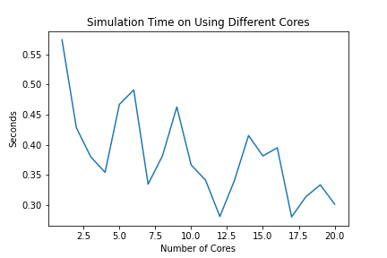
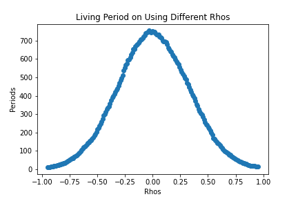

## Q1a ([Code](https://github.com/KekunH/rcc/blob/main/Q1/Q1a_mpi.py))
### The computation time before speeding up is 3.1003182511776686s, the computation time after speeding up is 2.185731455683708s 
### ([Output](https://github.com/KekunH/rcc/blob/main/Q1/Q1a.out))
## Q1b ([Code](https://github.com/KekunH/rcc/blob/main/Q1/Q1b_mpi.py))
### The graph is here 
## Q1c
### The speed up is not linear because the running time of using 1 core is already very low, there is not much potential to decrease the running time. In addition to that, running on mutiple cores require inter-connection between each core to share their results, which could delay the whole process.

## Q2a ([Code](https://github.com/KekunH/rcc/blob/main/Q2/Q2a_mpi.py))
### The computation time is 0.4075772762298584s ([Output](https://github.com/KekunH/rcc/blob/main/Q2/Q2a.out))
## Q2b ([Code](https://github.com/KekunH/rcc/blob/main/Q2/Q2b_mpi.py))
### The graph is here  ([Graph Code](https://github.com/KekunH/rcc/blob/main/Graph.ipynb))
## Q2c 
### The optimal persistence ρ is -0.03341708542713573, the average period is 754.757 ([Output](https://github.com/KekunH/rcc/blob/main/Q2/Q2a.out))

## Q3a ([Code](https://github.com/KekunH/rcc/blob/main/Q3/Q3a.py))
### Graph  
## Q3b ([Output](https://github.com/KekunH/rcc/blob/main/Q3/Q3a.out))
### The computation time using CPU is 0.0320894718170166s, the computation time using GPU is 0.06987738609313965s. One bottleneck I might facing is that the transfering time required to send information from cpu to gpu. And GPU is only better than CPU when you are perform one task at a massive scale.
## Q3c ([Code1](https://github.com/KekunH/rcc/blob/main/Q3/Q3c_10.py)) ([Code2](https://github.com/KekunH/rcc/blob/main/Q3/Q3c_20.py))
### When increasing the data size by 10 times, the CPU computation time is 0.49004650115966797s while the GPU computation time is 0.5036149024963379s. When increasing the data size by 20 times, the CPU computation time is 0.49907946586608887s while the GPU computation time is 0.3302168846130371s. GPU did progressively perform better than the CPU because GPU is good at perform one task at a massive scale. As the data size increase, its advantage would be more obvious. ([Output](https://github.com/KekunH/rcc/blob/main/Q3/Q3c.out))

